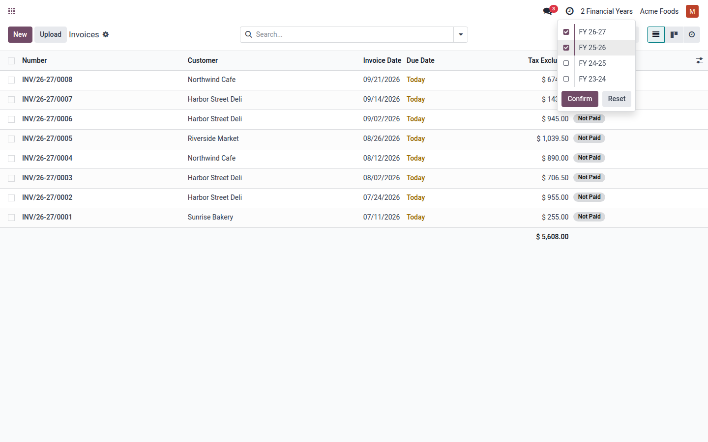
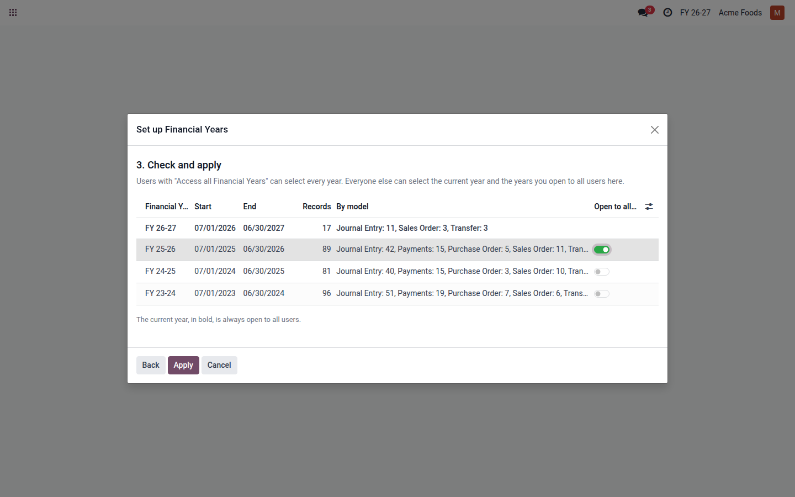
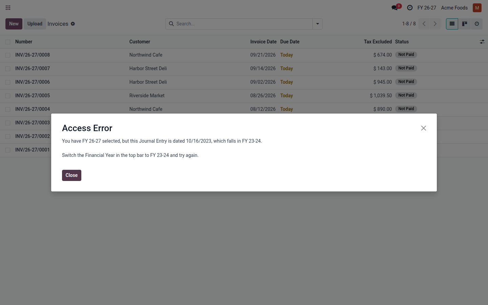
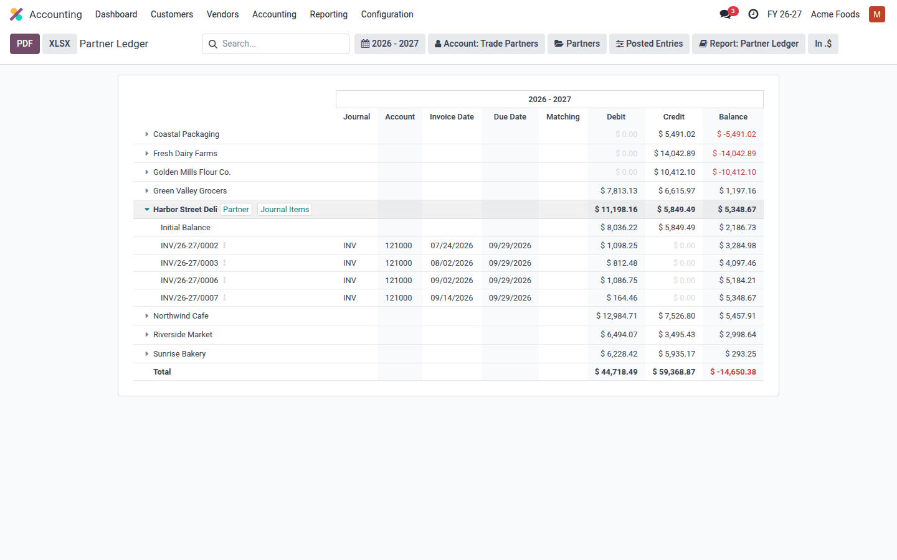
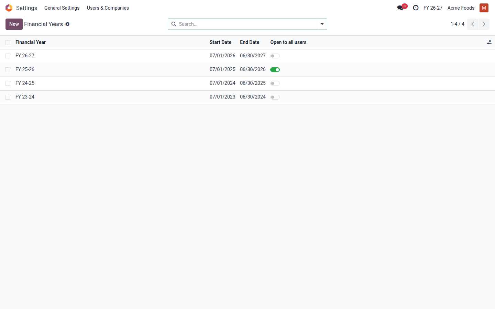

  

<h1 align="center">Financial Year Switcher</h1>

  Pick the fiscal year in the top bar, like the company switcher, and hide records outside the selected year: invoices, orders, transfers and payslips.

  
  
  

  <a href="https://apps.odoo.com/apps/modules/18.0/th_financial_year">
    <b>⬇&nbsp;&nbsp;Get it on Odoo Apps</b>
  </a>

---

## Overview

A Financial Year switcher next to the company switcher. Tick one fiscal year or several, and records of the models you choose that are dated outside them are hidden by record rules, in every list, report, export and API call.

A setup wizard opens after install. Nothing is hidden until you apply it.

  

## Features

- 📅 **Works like the company switcher**: tick one fiscal year or several, and every screen follows. On mobile too.
- 🔒 **Enforced, not filtered**: records outside the selection are hidden by record rules, so a search filter can't bring them back.
- 🗂️ **Any dated model**: journal entries, payments, sales and purchase orders, transfers, manufacturing orders, payslips, or your own.
- 👥 **Decide who sees past years**: users in **Access all Financial Years** (Settings and Accounting administrators) select every year; everyone else sees the current year and any year you open to all users.
- 📊 **Opening balances stay right**: on Odoo Enterprise, the Partner Ledger, General Ledger, Trial Balance and Aged Receivable and Payable still add up every earlier year.
- 💬 **Errors that say what to do**: instead of "top-secret records", users are told which year a record is in.
- 🤖 **AI assistants too**: assistants connected over MCP see exactly the years their user may.
- 🧭 **Set up in three steps**: your fiscal calendar, the models to scope, and a preview with record counts per year.

## Screenshots

### The switcher

  

### Check before you apply

  

### A message that says what to do

  

### Full-history opening balances

FY 26-27 selected: the Initial Balance includes earlier years, and only this year's invoices are listed.

  

### Your Financial Years

  

## Comparison

|                                       | Group by fiscal year apps | Financial Year Switcher |
| ------------------------------------- | :-----------------------: | :---------------------: |
| See records by fiscal year            |             ✓             |            ✓            |
| Switcher in the top bar               |             –             |            ✓            |
| Hidden by record rules, everywhere    |             –             |            ✓            |
| Past years limited to chosen users    |             –             |            ✓            |
| Correct opening balances in reports   |             –             |            ✓            |
| Setup wizard with preview             |             –             |            ✓            |

## What it doesn't do

- It doesn't run on Odoo Online (SaaS). You need Odoo.sh or your own server.
- There is one fiscal calendar per database, not one per company.
- Years start on the 1st of a month.
- It hides records; it doesn't lock them. Use Odoo's lock dates to stop posting in a closed period.
- The opening balance fixes apply to Odoo Enterprise's accounting reports. Community has no such reports, and the switcher works the same there.

## Documentation

- [Setup guide](docs/setup-guide.md): install and run the setup wizard.
- [Admin guide](docs/admin-guide.md): years, access, scoped models, and what users see.
- [Changelog](docs/CHANGELOG.md)

## Pricing & Versions

|                   |                                                                          |
| ----------------- | ------------------------------------------------------------------------ |
| **Price**         | $300 USD                                                                 |
| **Odoo versions** | 18.0                                                                     |
| **License**       | OPL-1                                                                    |
| **Covers**        | All your own databases on one Odoo version: production, staging and test |
| **Get it**        | [Odoo Apps listing](https://apps.odoo.com/apps/modules/18.0/th_financial_year)                                                  |

## Support

Built by **TechHive Solutions**, a certified Odoo Partner. We build AI integrations, ERP setups, custom Odoo plugins, and enterprise apps.

Setup and customisation cost $29/hour. Want to see it first? Book a 15-minute demo by email.

- 🌐 [techhivesolutions.com](https://techhivesolutions.com)
- ✉️ [info@techhivesolutions.com](mailto:info@techhivesolutions.com)

## License

The module is distributed under **OPL-1** via [Odoo Apps](https://apps.odoo.com/apps/modules/18.0/th_financial_year). Content in this repository © TechHive Solutions. Source code is not included here.
